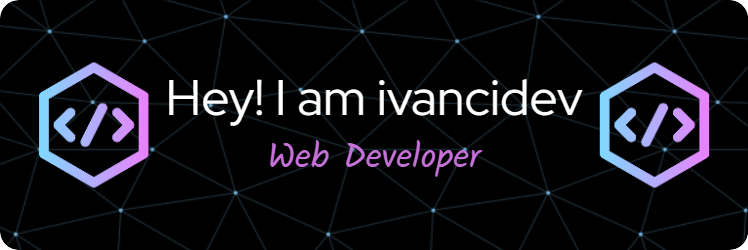

# Hello, World👋

### Social Networks

  

👨‍💻 All of my projects are available at [https://github.com/ivancidev](https://github.com/ivancidev)

📫 How to reach me **herlanherbas@gmail.com**

### About Me 😎
I am a web developer passionate about web-related technologies. I enjoy learning new tools and staying up to date with the latest technological trends. I like to share my knowledge and help others on their learning path.

## I’m currently learning 👨‍💻
I’m currently focusing on frontend development, practicing with JavaScript and creating small projects with React and Tailwind CSS. I’m also diving into backend development with NestJS, TypeORM, and Node.js using Express. Additionally, I’m learning about Dockerization, API creation, and more.

### Tecnologies 💻

### Frontend
 
 
 
 
 
 
 

### Backend
 

 
 
 
 
 

### Tools and Other Technologies
 
 
 
 
 

